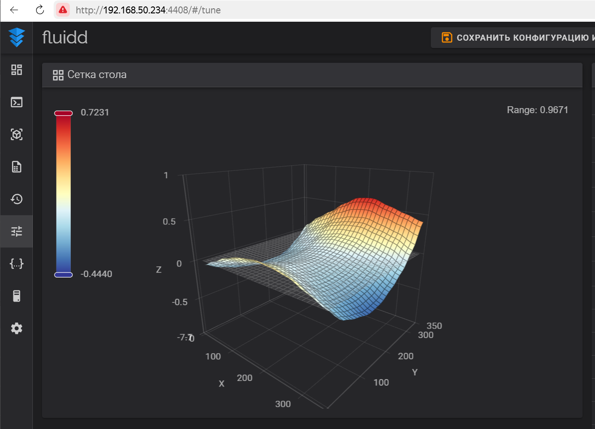
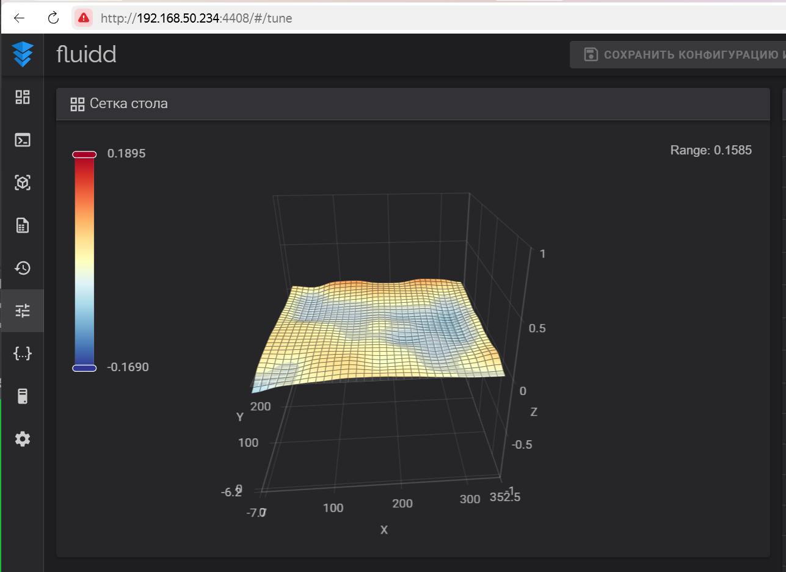

# 3dp-bed-mesh

Набор Python-скриптов для работы с картой высот стола 3D-принтера (`bed_mesh`) из прошивки Klipper (например, Creality K2 Plus): парсинг, интерполяция, генерация STL.

## Для чего это

Если стол с выраженной кривизной, например, "седлом" или "горбом", а сверху установлена гибкая PEI-пластина, вы можете:
- Распечатать выравнивающую прокладку между столом и пластиной.
- Тем самым компенсировать кривизну физически, а не только через `BED_MESH`.

Это актуально, если неровность значительная.

## Как работает

1. Скрипты считывают `bed_mesh` (который можно посмотреть в `printer.cfg` принтера) в текстовом формате.
2. Интерполируют данные до повышенного разрешения.
3. Генерируют STL-модель поверхности.
4. Результат — прокладка, точно повторяющая форму стола.

## Пример результата

До установки прокладки:



После установки прокладки:



## Практические советы

- Стоит печатать с увеличенным `z_offset` и уменьшенным `flow_rate`, чтобы уменьшить коробление.
- Использовать клей-спрей на столе, чтобы прилипание происходило и на впадинах.
- Материал — я использовал прозрачный PETG.
- Лучше выполнять печать в несколько итераций: первая прокладка — грубая, затем используем её как подложку и печатаем более точную версию (меняя высоту слоя от большей к меньшей и z_offset от большего к меньшему).

## Использование

```bash
python bed_mesh_to_stl_extended.py > bed_mesh_data.txt
````

или

```python
from bed_mesh_to_stl_extended import generate_stl_from_bed_mesh_text

generate_stl_from_bed_mesh_text(
    text=your_bed_mesh_text,
    resolution=100,
    edge_offset=0.2,
    output_path="shim.stl"
)
```

## Структура

- `parse_bed_mesh.py` — парсинг текстовой карты высот
- `interpolate_bed_mesh_surface.py` — интерполяция и экстраполяция
- `generate_stl_from_surface.py` — генерация STL-модели
- `bed_mesh_to_stl_strict.py` — генерация STL без выхода за границы карты
- `bed_mesh_to_stl_extended.py` — генерация STL с расширением за границы (у меня карта получается 340x340, а стол 350x350, расширение позволяет заполнить весь стол)

## Лицензия

Этот проект распространяется под лицензией **MIT**. Вы можете свободно использовать, изменять и распространять код, включая коммерческое использование. См. `LICENSE`.
